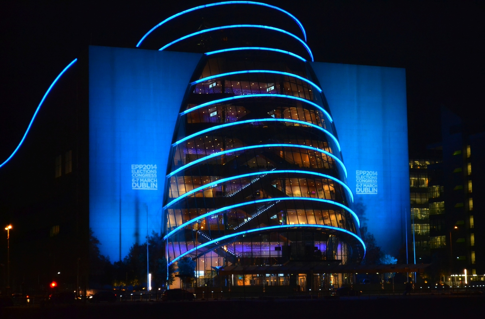

### Начало
**Точкой отсчета** можно считать весну 2009 года, когда мой муж, словно невзначай, рассказал мне о том, что еще до нашей встречи у него была мечта - иммигрировать в Новую Зеландию. Он рассказал, что много читал об этой стране и очень хотел бы там жить, но никаких решительных действий он не предпринимал, потому что было слишком много факторов, затрудняющих процесс. Это и английский язык на самом базовом уровне, и сложность с поиском работы, и дороговизна всего процесса иммиграции. Нельзя даже сказать какая из причин была более весомой, они представлялись словно непокоримые заснеженные вершины: кто-то их покорял, но дошли не все, а что случилось с теми, кто дошел - не ясно. 
<!-- more -->
Нужно признаться, до того, как муж поделился со мной своей несбыточной мечтой, я даже представить себе не могла, что однажды мы выйдем из аэропорта с тремя чемоданами и это будет началом новой жизни в новой стране. Пределом моих мечтаний был переезд в Киев. Задавшись вопросом "Новая Зеландия - это что и вообще где?", я прочитала, кажется, всю Википедию и остальные доступные мне на тот момент ресурсы и тоже заразилась идеей о переезде.
Увидев, что я поддерживаю идею с переездом в принципе, муж понемногу стал учить английский. Тем временем мы успели несколько раз переехать, пожениться, купить машину, родить ребенка, Сережа сменил профессию. 

### Как мы учили английский
Всерьез мы взялись за английский в 2011 году и так как английский язык у мужа хромал на две ноги, а у меня - на одну, то он пошел в бой первым. Изначально мы выбрали более дорогой и более продуктивный, на наш взгляд, способ изучения английского - с частным педагогом. Как и все, мы работали с 9 до 18 и иногда немного больше, так что на уроки у нас оставалось время до и после работы и по выходным. Был достаточно длительный период, когда мы занимались английским каждый вечер. Еще около полугода мы ходили на английский на 8 утра. Три дня в неделю с педагогом и еще три дня по часу у нас уходило на домашние задания, так что уложив ребенка спать, мы отправлялись на кухню и открывали наши учебники. В таком режиме прошел почти год, а может и немного больше. Мы, конечно, не железные, поэтому периодически мы забивали на домашние задания из-за усталости. 

Через два с половиной года изучения языка Сережа решил удаленно начинать искать работу в Новой Зеландии. Проще говоря, он рассылал резюме, сидя в Одессе, но никакого отклика не получал. Были компании, которые писали что-то вроде: "У Вас хорошее резюме, так что будете в Окленде - заходите на интервью".  Слетать в Окленд на интервью стоило как купить еще одну машину, так что поиски в какой-то момент остановились.
### План "Б"
У нас был запасной вариант, план "Б" по переезду - поехать на курсы изучения английского языка на полгода и быстренько искать работу. В таком подходе были свои риски и мы его не торопились реализовать.
В какой-то момент Сережа стал смотреть и в сторону других англоговорящих стран. Мы начали рассматривать Великобританию, Нидерланды. Позже включили в свой список  Германию и Польшу. Три месяца муж рассылал резюме по разным компаниям, было несколько интервью и даже job-offer в Польшу, но на сильно компромиссный вариант мой супруг не согласился.

Через три месяца поисков и попыток было решено оставить на время идею с переездом и просто учить язык, жить и работать в Одессе, попутно собирая деньги на "план Б". Мы сняли хорошую квартиру, я нашла себе замечательную, близкую к идеальной, работу, купила цветов домой, запланировали путешествие в Германию..  Иммиграция нам виделась в пятилетней перспективе, но в один прекрасный день мужу позвонили... из Ирландии. 
### Получили job-offer
На этапе собеседований все шло через пень-колоду: Сережа сказал, что он завалил первую видео-самопрезентацию, потом несколько раз по вине компании срывались и переносились интервью. Мы подумали, что компания как-то не очень серьезно себя ведет и ничего особенного от этих собеседований не ожидали и немного удивились, когда job-offer все-такие пришел. Это случилось в конце 2013 года ( подумать только, почти год назад!!!)  и было принято решение job-offer подписать. Ирландия, конечно, не Новая Зеландия, но это нам показалась отличной возможностью доучить язык, получить европейский опыт работы и попутешествовать по Европе.

Учитывая, что приземлились мы в Ирландии 7 февраля 2014 года, то на все про все у нас было 2 месяца, за которые нам нужно было съехать из квартиры, продать машину, отработать положенное, уволиться, закрыть ненужные счета, продать лишние вещи, несколько раз съездить в Киев по визовым вопросам, 2 недели провести в Германии, оформить все документы для получения виз. Нам везло, мы старались и все успели, а оглянувшись назад кажется, что эти два месяца по своей интенсивности сошли бы за год. 

Тому-то, кто знаком с нашей семьей поверхностно, могло показаться, что нам просто свезло, но мы-то знаем, сколько всего было сделано, чтобы в конце концов мы оказались там, где мы есть.
