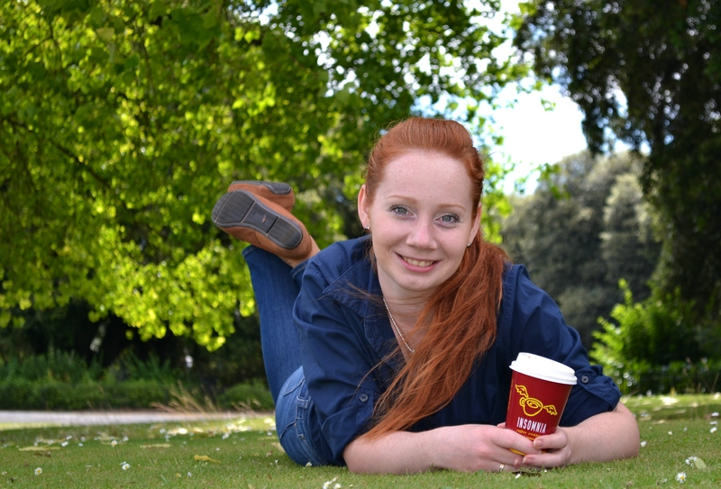

**Привет всем!**

Меня зовут Ирина Данилова и это мой блог об иммиграции и жизни в Ирландии. Я с мужем Сергеем и ребенком Никитой приехала сюда 7 февраля 2014 года и с тех пор живу в столице республики - Дублине.

В этом блоге я буду освещать темы, которые на мой взгляд, будут интересны людям, заинтересованным в иммиграции в Ирландию и просто тем, кому любопытно узнать "а как там?" Кроме того, тут вы сможете посмотреть мои фотографии с видами потрясающей ирландской природы и городов. Буду рада получать комментарии от читателей и обещаю регулярно отвечать на вопросы.

Добавляйтесь в друзья в [facebook](https://www.facebook.com/pr.danilova), [instagram](https://instagram.com/zlatovlasovna/), подписывайтесь на [twitter](https://twitter.com/PrDanilova) :)